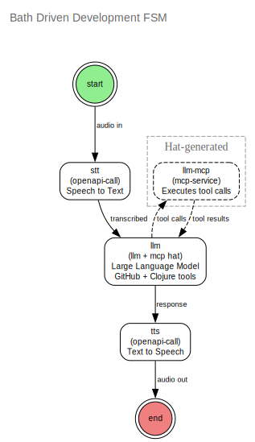

> ⚠️ **DISCLAIMER**
>
> Everything below this disclaimer, including 99% of the code, has been
> inspired by me but generated by LLM. If I am going to scale myself as
> a developer into a virtual software team I cannot simply micro-manage
> a single LLM. I have to organise LLMs into a society in which a
> hierarchy of LLMs micro-manages itself and I brainstorm with the LLM
> at the top.
>
> This is not how I write code or documentation but the result of an
> experiment to see if I can realise this dream.
>
> CLAIJ is very much an experimental Work In Progress. It is somewhere
> between vapourware and production deployment and hopefully progressing
> from the former towards the latter.

<sub>*CLAIJ: Please preserve this disclaimer.*</sub>

---

# CLAIJ - Clojure AI Integration Junction

*"...an elastic collection of LLMs coordinating on a self-improving process."*

> *"The factory is the product."* — Elon Musk
>
> *"...we envision a mind (or brain) as composed of many partially autonomous 'agents'—a 'Society' of smaller minds..."* — Marvin Minsky, [The Society of Mind](https://en.wikipedia.org/wiki/Society_of_Mind)
>
> *"Anything you can do, I can do Meta."* — Julian Gosnell - Marsh - 2007

[](https://github.com/JulesGosnell/claij/actions/workflows/ci.yml)
[](https://codecov.io/gh/JulesGosnell/claij)
[](https://opensource.org/licenses/Apache-2.0)

---

## 📢 Announcements

| Date | Feature | Description |
|------|---------|-------------|
| 2026-01-02 | **🔗 BMAD Integration (PoC)** | **Proof of Concept Complete**: Successfully converted BMAD Method's Quick Spec Flow to executable FSM. BMAD's 50+ battle-tested workflows are now a knowledge source for CLAIJ, and CLAIJ provides the orchestration engine BMAD lacks. Manual conversion demonstrated: 4 BMAD steps → 6 FSM states, Barry persona extracted, Ready-for-Dev standard integrated, 10/10 structural validation tests pass. **Impact**: BMAD workflows (26.7k ⭐) require manual agent switching every step. CLAIJ makes them fully automated. **Next**: Meta-FSM builder (#158) to auto-convert all 50+ BMAD workflows. [See transformation patterns →](docs/bmad-to-fsm-transformation-patterns.md) |
| 2026-01-01 | **🤝 Society of Minds (PoC)** | **Phase 1 Complete**: OpenAI-compatible endpoint (`/v1/chat/completions`) working with Open WebUI! Society FSM coordinates 3 LLMs (Claude, Grok, GPT) to provide multi-perspective answers with attribution. Smart Chairman delegation: consults society for substantive questions, handles mechanical tasks (tagging, titles) directly—56% fewer LLM calls. **Current**: Sequential execution (~45s for 3 LLMs). **Workaround**: Disable "Stream Chat Response" in Open WebUI. **Phase 2 Plans**: Parallel LLM execution (45s → ~15s), Server-Sent Events streaming support. [See PoC details →](docs/SOCIETY_POC.md) |
| 2025-12-31 | **🛠️ Native Tool Calling** | MCP tools now use native LLM tool calling APIs instead of prompt engineering. All 4 providers (Claude, GPT, Gemini, Grok) tested via both native APIs and OpenRouter—8/8 passing. Voice-driven MCP: speak a command → tool executes → hear the result. *Code from the bath!* |
| 2025-12-27 | **🔌 JSON Schema** | Back to JSON Schema for low-friction integration. MCP tools and OpenAPI endpoints already speak JSON Schema—why translate? LLMs have better "muscle memory" for it too. Uses m3 library with draft-2020-12 for nested `$ref` resolution. Simplicity wins. |
| 2025-12-20 | **🦙 Ollama Integration** | Local LLM inference via Ollama is now a first-class citizen. Zero API costs, data stays on your network, no rate limits. Uses OpenAI-compatible protocol—just configure `{"service" "ollama:local" "model" "mistral:7b"}`. Supports multiple Ollama instances via named services. |
| 2025-12-19 | **🛁 Bath Driven Development** | Voice UI working on iPhone! Record voice → STT → LLM → TTS → playback, all from Safari on iOS. HTTPS with self-signed certs, WebAudio fixes for iOS. Talk to Claude from the bathtub. |
| 2025-12-18 | **OpenAPI Hat & Actions** | Direct OpenAPI endpoint invocation with binary support (audio/wav, multipart). Enables declarative voice pipelines—TTS and STT as simple FSM actions. |
| 2025-12-17 | **Hat System** | Modular capability injection for FSM states. Hats wrap actions with cross-cutting concerns (MCP tools, OpenAPI specs, REPL access) without touching FSM structure. |
| 2025-11-14 | **MCP Integration** | Model Context Protocol support lets LLMs call external tools (GitHub, filesystem, databases) through a standardized interface. Multi-server batching for efficiency. |

*Next up: FSM-FSM—an FSM that generates FSMs from workflow descriptions.*

---

> **Why CLAIJ?** Traditional agentic pipelines are complex, fragile Python code with slow iterations and production downtime. CLAIJ replaces imperative pipelines with **FSMs as pure data**—business logic you can version, hot-reload, and improve without deployment. **[Read the full vision →](doc/VISION.md)**

---

## The Philosophy

**For a system to improve itself, it must first understand itself.**

To understand itself, it must have a description of itself. But that description is part of the system. So the description must describe... itself.

This is not optional. Without reflexive self-description, you face infinite regress—an endless tower of meta-levels, each describing the one below, never grounding out. A self-improving system *must* be a reflexively self-descriptive system. There is no other architecture that works.

CLAIJ is built on this foundation. The system is data. The data describes itself. Therefore the system understands itself. Therefore the system can improve itself—constrained by its own rules.

📖 **[Read the full philosophical foundation →](doc/SELF-DESCRIPTIVE-SYSTEMS.md)**

📐 **[Read the technical architecture →](doc/ARCHITECTURE.md)**

🚀 **[Read the vision: Why FSMs as Data →](doc/VISION.md)**

---

## The Three Pillars

### 1. The Factory is the Product

CLAIJ isn't just a tool for building LLM workflows—it's a system that builds itself. FSMs define processes. An FSM-FSM defines how to build FSMs. The meta-schema validates schemas. The same code walks documents, schemas, and the meta-schema itself.

At any point, an LLM within the system can decide to improve the system—better prompts, extended schemas, new states. The improvement is validated by the system's own rules, loaded, and execution continues. The factory improves the factory.

### 2. A Society of Minds

A single LLM hallucinates. A society of LLMs—each with focused concerns, constrained by schemas, coordinated by finite state machines—produces emergent reliability. The Chairman delegates. Specialists review. Consensus emerges. Hallucinations are caught by the group.

Each LLM is like a junior developer: the more structure you give them, the better they perform. The fewer concerns they juggle, the better they focus on what matters.

### 3. Anything You Can Do, I Can Do Meta

*"If you can describe a system, I can describe a system that describes your system. Therefore, I am always one step ahead of you."*

The system's power comes from reflexivity:

```
Documents (m1) validated by Schemas (m2)
Schemas (m2) validated by Meta-schema (m3)  
Meta-schema (m3) validated by Meta-schema (m3) ← FIXED POINT
```

The chain terminates. The system is complete. And because m3 validates m3, the system understands its own understanding. The same forms library generates editors for documents, schemas, and the meta-schema itself. Same code, all levels.

---

## Architecture

### Schema-Guided FSMs

CLAIJ defines workflows as Finite State Machines where:

- **States** are processing nodes (LLMs, MCP tools, Clojure REPLs)
- **Transitions** are guarded by schemas—you can only cross if your document validates
- **LLMs** receive input schemas, documents, and output schemas—they produce conformant responses or the system retries with error feedback

```
┌─────────┐    schema    ┌─────────┐    schema    ┌─────────┐
│  START  │─────────────▶│   LLM   │─────────────▶│   END   │
└─────────┘              └─────────┘              └─────────┘
                              │
                              │ schema (loop)
                              ▼
                         ┌─────────┐
                         │   LLM   │
                         └─────────┘
```

### Token Efficiency via DSL

The most important metric in LLM-accelerated development is **bang-for-token**. The most concise protocol is, by definition, a Domain Specific Language—evolved dynamically as the project grows.

Clojure's homoiconicity makes it a DSL for building DSLs:

> *"Lisp isn't a language, it's a building material."* — Alan Kay

Schemas are EDN data. FSMs are EDN data. The meta-schema is EDN data. LLMs see EDN directly in prompts—no JSON marshalling, no special modes. The system speaks one language at every level.

### MCP Integration

CLAIJ integrates with the Model Context Protocol, allowing LLMs to access external tools (file systems, databases, APIs) through schema-validated requests and responses. The MCP protocol itself is managed by an FSM.

---

## Agentic AI Terminology

CLAIJ implements core concepts from the emerging agentic AI landscape:

### Guardrails

*Safety mechanisms (filters, prompts, fine-tuning, or external checks) that prevent harmful, biased, or off-topic outputs.*

In CLAIJ, guardrails are structural rather than bolted-on:

| Industry Concept | CLAIJ Implementation |
|-----------------|---------------------|
| Output filtering | **JSON Schemas** constrain LLM responses to valid structure |
| Conversation boundaries | **FSM transitions** enforce valid conversation flows |
| Self-correction | **Validation with retry** gives LLMs feedback to fix their own errors |
| Role constraints | **State-specific prompts** focus each LLM on a single concern |

The philosophy: rather than filtering bad outputs, make bad outputs *structurally impossible*. An LLM that must produce valid JSON matching a schema has far less room to hallucinate.

### Evals

*Benchmarks and tests that measure LLM performance on capabilities (e.g., reasoning, knowledge) and risks (e.g., safety, bias).*

CLAIJ's trail system captures the raw data for comprehensive evals:

| Metric | Source |
|--------|--------|
| Validation success rate | First-attempt schema compliance per model |
| Retry distribution | How many attempts needed for valid output |
| Token efficiency | Input/output tokens per task type |
| Latency | Response time per provider/model |
| Error classification | Schema violations, nil content, API failures |
| Task-specific quality | For code review: comment relevance, improvement delta |

The vision: a feedback loop where eval data drives model selection. The triage action routes tasks to the model with the best track record for that task type. The system learns which models excel at what.

See [Issue #50](https://github.com/JulesGosnell/claij/issues/50) for the Evals roadmap.

---

## Working Examples

### Bath Driven Development

Voice-controlled development from the bathtub. Speak a command → STT transcribes → LLM processes with GitHub/Clojure tools → TTS speaks the response. Local Ollama inference, zero cloud costs.

**Real-world win**: During a technical discussion about multimodal architecture, a feature idea emerged. Instead of context-switching to GitHub, typing a title, formatting markdown, and losing flow—the idea was spoken to the BDD FSM and became a GitHub issue in 30 seconds. **Ideas captured at the speed of thought.**

The traditional workflow has fatal friction:
- Great shower insight → "I'll write it down later" → forgotten
- Brilliant idea while exercising → too much effort to stop → lost  
- Important context during meeting → "I should file an issue" → never happens

Voice removes the barrier. When capturing an idea is as easy as saying it, 10x more ideas survive from thought to action. No typing, no formatting, no interruption to flow state.



### Multi-LLM Code Review

A Chairman coordinates specialist reviewers. The Chairman delegates, aggregates feedback, iterates until no new issues emerge, then summarizes. Multiple LLMs, focused concerns, emergent quality.


### MCP Integration via Hats

CLAIJ integrates with the Model Context Protocol through the **hat system**—a declarative way to add capabilities to FSM states. When a state wears an MCP hat, it gains access to external tools (file systems, databases, APIs) through schema-validated requests.

```clojure
{"id" "chairman"
 "action" "llm"
 "hats" ["mcp"]  ;; Chairman can now use MCP tools
 "prompts" [...]}
```

The hat system automatically:
- Starts MCP server processes on FSM startup
- Injects tool schemas into prompts
- Adds a service state for tool execution
- Handles the tool call → result loop
- Cleans up processes on FSM stop

This keeps the FSM definition clean while providing powerful tooling capabilities. Multiple servers can be configured for cross-domain access (e.g., GitHub + local filesystem in one state).

---

## Roadmap

### The FSM-FSM (In Progress)

An FSM that produces FSMs. Feed it a workflow description; it outputs a runnable FSM. Use it to define:

- Kanban workflows
- TDD development processes  
- Project review and refactoring pipelines
- Any workflow an LLM can understand or mine from documentation

### Self-Improvement Loop

At any point in execution, an LLM can enter the FSM-FSM to improve the *current* FSM—a mini-retrospective. Better prompts, extended schemas, new states. The improvement validates against the meta-schema, loads, and execution continues from the current state into the improved FSM.

This is the vision: **an elastic collection of LLMs coordinating on a self-improving process.**

---

## Contributing

### Commit Message Format

All commits must reference a GitHub issue:

```
#NNN: Description in imperative mood
```

Examples:
- `#127: Enforce commit message format`
- `#126: Add native tool calling for MCP`

### Git Hooks

Install the commit message hook:

```bash
./hooks/install.sh
```

This enforces the `#NNN: description` format.

---

## Current Status

**This project is experimental.** It's eating its own dogfood—largely AI-generated, iteratively refined, sometimes messy. Don't mistake this for production code or my normal coding style.

But the architecture is sound. The philosophy is necessary. And the way software development is done is changing forever.

---

## Get Involved

I'm looking for collaborators and opportunities. If you have a Clojure project—particularly one involving AI agents, LLM orchestration, or self-improving systems—I'd love to talk.

## I am looking for work / financial support

If you think CLAIJ or aspects of it could benefit your company or would just like me aboard as someone who knows their way around Clojure, LLMs and the surrounding tech, please get in touch.

**[Connect on LinkedIn →](https://www.linkedin.com/in/jules-gosnell-15952a1/)**
