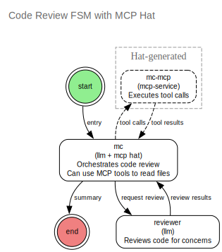
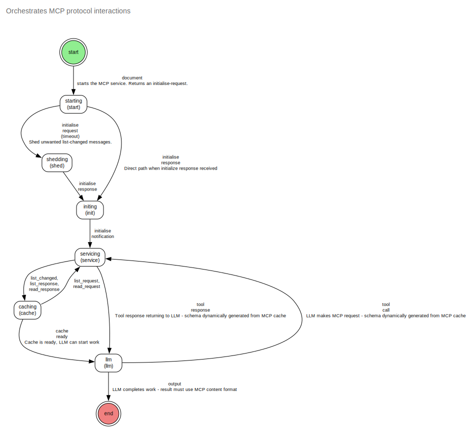

# CLAIJ Architecture

> *"The factory is the product."* — Elon Musk
>
> *"...we envision a mind (or brain) as composed of many partially autonomous 'agents'—a 'Society' of smaller minds..."* — Marvin Minsky, The Society of Mind
>
> *"Anything you can do, I can do Meta."* — Julian Gosnell

CLAIJ is an AI-driven workflow engine for producing AI-driven workflows, and a platform on which to run them.

Instead of manually bolting things together in LangChain or LangGraph, you give CLAIJ your problem domain and ask it to design a workflow to solve your problem. It produces a workflow and runs it for you. Furthermore, as it runs—solving your problem and learning on the job—it reviews itself and seeks to improve your workflow.

---

## Table of Contents

1. [Questions This Project Answers](#questions-this-project-answers)
2. [Self-Descriptive Systems](#self-descriptive-systems)
3. [Core Architectural Principles](#core-architectural-principles)
4. [Finite State Machines](#finite-state-machines)
5. [Schema-Guided Conversations](#schema-guided-conversations)
6. [JSON Schemas](#json-schemas)
7. [Actions](#actions)
8. [MCP Integration](#mcp-integration)
9. [Foldable Trail Architecture](#foldable-trail-architecture)
10. [Development Workflow](#development-workflow)
11. [FSM Composition](#fsm-composition)
12. [Vision: Self-Evolving AI Organizations](#vision-self-evolving-ai-organizations)
13. [Supporting Components](#supporting-components)
14. [Working Examples](#working-examples)
15. [Design Principles](#design-principles)
16. [Implementation Status](#implementation-status)
17. [Roadmap](#roadmap)
18. [References](#references)

---

## Questions This Project Answers

- What if we used the right language instead of hobbling ourselves before we even started?
- What if reducing the number of concerns an LLM deals with improves its output?
- What if having one AI check another AI's homework results in better output?
- What if we used FSMs to coordinate LLMs as they work on their appointed problems?
- What if these FSMs were part of a self-descriptive system?
- What if we fed these FSMs back into themselves and asked the LLMs to improve them?
- What if these improvements could be applied dynamically as the LLMs were using them?
- Could such a system eventually code up an app from zero and maintain it going forward?

---

## Self-Descriptive Systems

*For the full philosophical foundation, see [SELF-DESCRIPTIVE-SYSTEMS.md](SELF-DESCRIPTIVE-SYSTEMS.md).*

For a system to **improve itself**, it must first **understand itself**. To understand itself, it must have a **description of itself**. But that description is part of the system. So the description must describe... itself.

Without reflexivity, you face infinite regress:

```
m1 validated by m2
m2 validated by m3
m3 validated by m4
...forever
```

The **reflexive** (fixed point) solution terminates the chain:

```
Documents (m1) validated by Schemas (m2)
Schemas (m2) validated by Meta-schema (m3)
Meta-schema (m3) validated by Meta-schema (m3) ← FIXED POINT
```

This is not optional. A self-improving system *must* be a reflexively self-descriptive system. CLAIJ is built on this foundation.

---

## Core Architectural Principles

### Foundational Structured Messaging

All interactions in the LLM society rely on structured JSON messages—both requests and responses—treated symmetrically as proposals. Each message is validated against JSON Schemas tied to FSM transitions, ensuring no invalid or hallucinated data slips through.

### Finite State Machine as Control Flow

The FSM defines states as simple labels (e.g., human-init, mc-router, dev-llm-state) and transitions as schema-validated arcs with optional hooks for side-effects like tool execution. The FSM routes messages without inherent direction, firing transitions only when a proposal matches an outgoing schema, enabling reliable, decentralized coordination without central scripting.

### Asynchronous Processing for Scalability

Fully asynchronous HTTP requests and dispatches handle thousands of in-flight messages without blocking threads. The FSM tracks handles or IDs for replies, ensuring no orphaned processes while respecting timeouts or retries embedded in schemas.

### Memory Management Tied to FSM Paths

Memory is bound to the active path: log all prompts, requests, and responses raw during execution for perfect recall in prompts. At path end, summarize and feed into global or task-local memory, preventing ballooning while passing only necessary state to dependents. This optimizes token efficiency by keeping active prompts concise.

### Emergent DSL for Efficiency

As the society runs on structured messages and accumulates memory/logs, agents dynamically evolve a domain-specific language (DSL) as a compression layer. This shorthand is negotiated via toolsmith or retros, inserted into prompts for efficiency, without replacing core JSON Schema validation.

### Dynamism

All features—including roles, states, transitions, FSM, tools, schemas, DSLs, functions, LLM definitions, MCP definitions, prompts, and prompt combinations—can be created or modified dynamically without restarting the server. FSMs can even define themselves as they are traversed.

---

## Finite State Machines

The CLAIJ FSM system enables **schema-guided multi-agent LLM workflows** where LLMs dynamically assume different roles and cooperate on clearly defined tasks. Each state transition is governed by JSON Schema, creating a self-describing, evolvable system where **FSMs can create, modify, and orchestrate other FSMs**.

### FSM Definition Structure

An FSM is defined by:

- **States**: Nodes representing different roles/responsibilities (Chairman, reviewer, BA, end, etc.)
- **Transitions** (xitions): Edges between states, each backed by a `core.async` channel
- **Schemas**: JSON Schema definitions constraining valid transitions
- **Actions**: Functions executed when entering a state (LLM calls, MCP services, human endpoints)

Each state's `go-loop` monitors all incoming transition channels using `alts!`, routing events to the appropriate handler based on the transition schema.

### String Keys

All FSM definitions and schemas use string keys (not keywords) because:

- FSM definitions will be dynamically generated and loaded documents
- Keys may be copied to values and vice versa
- Removes confusion between schema property names and Clojure keywords
- Maintains consistency across the entire system

### FSM-Scoped Memory

The trail serves as **bounded memory** for each FSM execution:

- Each LLM has perfect memory for its path through the current FSM
- Memory naturally bounded by FSM lifetime
- No context explosion across FSM boundaries
- Future: Summarization at FSM completion, potential merging of parallel FSM summaries

---

## Schema-Guided Conversations

The trail (conversation history) maintains each message as a triple:

```clojure
[input-schema, input-document, output-schema]
```

This provides:

1. **input-schema** - describes the incoming transition
2. **input-document** - the actual data being processed
3. **output-schema** - constrains the LLM's response format

Schemas become **part of the conversation**, helping LLMs understand both what they're receiving and what they must produce.

### Schema Constraints (Token Optimization)

FSM schemas enforce constraints that optimize token usage:

**Ref-Based Schemas** - Use `[:ref :key]` format:

```clojure
"schema" [:ref :event/request]  ; ✓ Valid - references FSM's registry
"schema" [:map ...]             ; ✗ Prefer refs for large schemas
```

This enforces **token compression**: The FSM schema (with all definitions) is provided once as a system prompt, while transition schemas in the conversation history are just compact references.

---

## JSON Schemas

All validation uses JSON Schema via the [m3](https://github.com/julesgosnell/m3) library (draft-2020-12).

**Why JSON Schema?**
- **LLM compatibility** - LLMs have extensive training on JSON Schema; smaller/local models struggle with alternative formats
- **Integration native** - MCP tools and OpenAPI endpoints define schemas in JSON Schema
- **Composition layer** - CLAIJ connects external integrations using their native schema format

### Schema Registry Pattern

```json
// FSM definitions include schemas in $defs
{
  "id": "my-fsm",
  "schemas": {
    "$defs": {
      "foo": {"type": "object", "properties": {"x": {"type": "integer"}}},
      "bar": {"type": "object", "properties": {"y": {"type": "string"}}}
    }
  },
  "xitions": [
    {"schema": {"$ref": "#/$defs/foo"}},
    {"schema": {"$ref": "#/$defs/bar"}}
  ]
}
```

```clojure
;; At runtime, xition schemas inherit FSM's $defs
(schema/validate xition-schema fsm-defs value)
```

### Schema Types in Transitions

1. **Inline JSON Schema** - Full schema (avoid for large schemas)
2. **$ref** - `{"$ref": "#/$defs/type-key"}` resolved against FSM's `$defs` (preferred)
3. **String** - Dynamic lookup in `context[:id->schema]`

---

## Actions

Actions are functions executed when entering a state:

```clojure
(defn my-action [context fsm ix state event trail handler]
  ;; Process event, call handler with result
  (handler new-context output-event))
```

### Standard Actions

- **llm** - Call LLM with prompts built from FSM config and trail
- **service** - Route to external services (MCP)
- **end** - Terminal action

### The LLM Action

The `llm-action` function is shared by all FSMs that use LLM states:

```clojure
(defn llm-action
  "FSM action: call LLM with prompts built from FSM config and trail.
   Extracts provider/model from input data, defaults to openai/gpt-4o."
  [context fsm ix state trail handler]
  ...)
```

Key points:

- **Builds prompts** from FSM schema, state prompts, and conversation trail
- **Calls LLM** with provider/model from input data (or defaults)
- **Returns `(handler context output)`** - FSM handler validates output against schema
- **No structured output schema needed** - FSM handler already validates and retries on failure

---

## MCP Integration

CLAIJ integrates with Model Context Protocol (MCP) services by modeling the entire MCP protocol lifecycle as an explicit Finite State Machine.

**Key Insight:** Rather than hiding MCP interactions in opaque action functions, we express the protocol as FSM states and transitions. This provides:

- Self-documenting protocol flow
- Schema validation at each transition
- Visual representation of interactions
- Composability with other FSMs

### Protocol Flow

1. **starting** - Receives user's document, starts MCP bridge
2. **shedding** - Drains startup `list_changed` notifications
3. **initing** - Receives initialization response with capabilities
4. **servicing** - Sends `initialized` notification
5. **caching** - Reactive cache population from `list_changed`
6. **llm** - LLM with access to MCP tools
7. **end** - Terminal state

The user's original request rides along through initialization states, then gets delivered to the LLM once the service is ready.

### Message Wrapping

MCP messages are wrapped at the application layer for FSM routing:

```clojure
;; Outbound (FSM → Service)
{"id" ["caching" "servicing"]
 "message" {"jsonrpc" "2.0", "id" 123, "method" "tools/list"}}

;; Inbound (Service → FSM)
{"id" ["servicing" "caching"]
 "type" "response"
 "data" {"jsonrpc" "2.0", "id" 123, "result" {...}}}
```

---

## Foldable Trail Architecture

### Problem Statement

Linear trails accumulate unbounded context:

- MCP protocol details pollute LLM prompts
- Token costs grow linearly with conversation length
- No way to "complete" a subgoal and move on with just a summary
- Claude Desktop approach: all MCP operations added serially until context exhausted

### Solution: Hierarchical Scopes with Summarization

Trail becomes a **foldable tree** instead of linear sequence. Scopes can be:

- **Folded**: LLM sees only summary (token-efficient)
- **Unfolded**: Full detail available for debugging/audit

### Visual Example

```
[Main Goal: Build web app]
  ├─ "I need to set up GitHub"
  │
  ├─ PUSH MCP(GitHub) scope ────┐
  │    ├─ Initialize service    │ Full MCP
  │    ├─ Create repo           │ protocol 
  │    ├─ Add files             │ detail here
  │    ├─ Set webhooks          │ (thousands of tokens)
  │    └─ EXIT: summarize ──────┘
  │       ↓
  │    "Setup complete: repo 'myapp' created, 3 files added, webhook configured"
  │
  ├─ [Back to main] Continue with summary only (20 tokens vs 5000)
  │
  ├─ PUSH MCP(Slack) scope ─────┐
  │    ├─ Auth/connect          │ More protocol
  │    ├─ Send notification     │ detail
  │    └─ EXIT: summarize ──────┘
  │       ↓
  │    "Team notified in #dev channel"
  │
  └─ Complete main goal
```

### Trail Structure

**Folded View (What LLM Sees):**

```clojure
[{:uuid "550e8400-..."
  :type "message" 
  :content "Build me a web app"}
 
 {:uuid "a1b2c3d4-..."
  :type "scope"
  :name "github-mcp"
  :folded true
  :summary "Created repo 'myapp', added 3 files, configured webhook"
  :children-uuids ["uuid1" "uuid2" "uuid3" ...]}
 
 {:uuid "e5f6g7h8-..."
  :type "scope"
  :name "slack-mcp" 
  :folded true
  :summary "Posted update to #dev channel"
  :children-uuids ["uuid4" "uuid5" ...]}]
```

### Key Properties

1. **Token Efficient**: LLM only sees summaries in context
2. **Full Audit Trail**: All details preserved, accessible by UUID
3. **Clean Separation**: Scopes contain their complexity
4. **Hierarchical**: Scopes can nest (sub-sub-goals)
5. **Lazy Loading**: Unfold only when needed (error recovery, debugging)

### Operations

```clojure
;; Scope Entry
(push-scope! trail {:name "github-mcp"
                    :uuid (uuid)
                    :parent-uuid current-scope})

;; Scope Exit
(pop-scope! trail {:summarize-fn github-summarizer})

;; Unfold (For Debugging)
(unfold-scope trail scope-uuid)
```

### Scalability Example

```
Root FSM: "Build e-commerce platform" (50 tokens)
├─ [Folded] Infrastructure setup (summary: 20 tokens)
│            [Storage: 50,000 tokens of AWS/K8s details]
├─ [Folded] Backend API (summary: 30 tokens)
│            [Storage: 100,000 tokens of coding sessions]
├─ [Folded] Frontend (summary: 25 tokens)
│            [Storage: 75,000 tokens of React work]
└─ [Folded] Deployment (summary: 30 tokens)
             [Storage: 40,000 tokens of CI/CD work]

LLM Context: ~155 tokens
Total Work Preserved: 265,000 tokens
```

---

## Development Workflow

CLAIJ's development workflow combines **Kanban-style task management** with **FSM governance** orchestrated by a **Chairman**.

### The Kanban Board

```
Backlog → Ready-for-Analysis → Analysis → Ready-for-Dev → Dev → Done
```

### The Chairman

The Chairman is a special role that orchestrates workflow transitions:

1. **Story Selection**: Pick highest-priority story from Ready-for-Dev
2. **Zone Management**: Lock/unlock code areas; queue conflicting work
3. **FSM Orchestration**: Trigger state transitions and sub-FSM entry/exit
4. **Vote Management**: Conduct votes when decisions need team consensus
5. **Merge Enforcement**: Validate tests pass; enforce atomic commits
6. **Retrospective Facilitation**: Run retros when Ready-for-Dev empties

The Chairman does not write code or make technical decisions—it facilitates the process.

### The Meta-Loop

Triggered when **Ready-for-Dev becomes empty**:

```
┌─────────────────────────────────────────────────┐
│              META-LOOP (Chairman-driven)              │
├─────────────────────────────────────────────────┤
│  1. Retrospective                               │
│     - Review what caused jams/blockers          │
│     - Identify patterns (good and bad)          │
│     - Vote on process improvements              │
│     - Update workflow rules if needed           │
│                                                 │
│  2. Planning Refill                             │
│     - Pull stories from Backlog                 │
│     - Size stories (small/medium/large)         │
│     - Prioritize by value/impact                │
│     - Load Ready-for-Dev with next batch        │
│                                                 │
│  └─→ Return to Story Loop                       │
└─────────────────────────────────────────────────┘
```

### The Story Loop

For each story picked from Ready-for-Dev:

1. **Pick Story** - Select highest priority from Ready-for-Dev
2. **Zone Check** - Lock code areas, queue conflicting work
3. **API Design** - Gather proposals, vote, lock API contract
4. **Implement** - Assign roles (coder, tester, documenter, toolsmith)
5. **Test** - Run test suite, loop back if fail
6. **Merge** - Atomic commit to main
7. **Close** - Move story to Done

### Zone Management

Zones are code areas (files, namespaces, functions) that get locked during active work:

1. Story claims zones at start of implementation
2. Chairman maintains zone lock registry
3. Subsequent stories that overlap locked zones are queued
4. Zones unlocked after merge to main
5. Queued stories automatically picked by Chairman after unlock

---

## FSM Composition

*For detailed design decisions and implementation status, see [FSM-COMPOSITION.md](FSM-COMPOSITION.md).*

FSMs can be composed in several ways, each with implications for prompt history and control flow:

| Pattern | Status | Description |
|---------|--------|-------------|
| **Sub-FSM** | ✅ Implemented | Parent delegates to child, waits, continues. Child trail filtered/summarized. |
| **Chain** | 📋 Designed | FSM-A completes → FSM-B starts with full trail. One continuous conversation. |
| **Fork-Join** | 📋 Designed | Spawn N children in parallel, wait for all, aggregate results. |
| **Event-Driven** | 🔮 Future | FSMs communicate via pub/sub on shared event bus. |

### Key Principle: LLMs Don't Need to Know About FSMs

When composing FSMs, we synthesize prompt history that presents the composition as simple "I asked, I received" interactions. The parent LLM never sees the child's internal deliberations—just the outcome.

### Sub-FSM (Implemented)

```clojure
{"id" "delegate"
 "action" "fsm"
 "config" {"fsm-id" "child-calculator"
           "success-to" "collect"
           "trail-mode" :summary}}  ; :omit | :summary | :full
```

Trail modes control how much child detail appears in parent context:
- `:omit` - Only result, no child trail info
- `:summary` - FSM id, step count, first/last events  
- `:full` - Complete child trail (use sparingly)

### Persistence & Long-Running Workflows

For human-in-the-loop workflows spanning hours/days/weeks, see [FSM-COMPOSITION.md](FSM-COMPOSITION.md#persistence--long-running-workflows). The trail is already an event log—we just need checkpoint storage and resume webhooks.

### Composition Patterns (Vision)

**Sequential:**
```clojure
design-fsm → implementation-fsm → testing-fsm → deployment-fsm
```

**Parallel:**
```clojure
(parallel
  security-review-fsm
  performance-review-fsm
  code-quality-review-fsm) → merge-results-fsm
```

**Recursive:**
```clojure
project-fsm spawns [feature-fsm feature-fsm ...]
feature-fsm spawns [task-fsm task-fsm ...]
```

---

## Vision: Self-Evolving AI Organizations

### The Triage FSM

The **general-problem-solving-fsm** acts as a universal entry point and orchestrator:

```
Human Input (voice/text)
        ↓
    [Triage State]
        ↓
┌───────┴────────┐
│ Load FSM Store │ → [id, version, description]
└───────┬────────┘
        ↓
┌───────────────────────────────────┐
│ Search/Select FSM                 │
│ - Search descriptions for fit     │
│ - Prefer load by version (caching)│
│ - Consider adaptation vs new      │
└───────┬───────────────────────────┘
        ↓
    ┌───┴────┐
    │ Found? │
    └───┬────┘
    Yes │   No
        │    └──────→ [BA State: Build Minimal FSM]
        │                   ↓
        │            Store FSM, Start FSM
        │                   ↓
        └──────→ [Start Selected/Built FSM]
                           ↓
                   [FSMs improve themselves
                    during execution]
```

### Sub-FSM Spawning: Contextual Interruption and Resumption

FSMs support **interruptibility** - pausing one FSM, spawning another, then resuming with modified context:

```clojure
;; Original "baking-cake" FSM running
[Human: "Add cream to the mixture"]
    ↓
[Execution State: Processing instruction]
    ↓
[LLM thinks: "Perhaps recipe should allow yogurt instead"]
    ↓
[SPAWN: recipe-improvement-fsm]
    │
    ├─→ [Nutritionist State: Analyze substitutions]
    ├─→ [Chef State: Taste compatibility check]
    ├─→ [Consensus State: Approve oneOf[cream, yogurt]]
    ↓
[RETURN: Updated schema with oneOf constraint]
    ↓
[RESUME: baking-cake-fsm with enhanced schema]
```

This enables **dynamic schema evolution** - FSMs don't just execute tasks, they can reshape their own contracts mid-execution.

### Human-in-the-Loop States

FSMs can integrate with human endpoints:

```clojure
{"id" "human-approval"
 "action" "human://text"  ; or "human://voice"
 "description" "Wait for human input via text interface"
 "schema" [:ref :approval-request]}

{"id" "voice-consultation"
 "action" "human://voice"
 "description" "Engage human via voice conversation"
 "schema" [:ref :consultation-schema]}
```

Integration modes:

- **Text**: Async input via chat interface
- **Voice**: Real-time voice conversation with TTS/STT
- **Approval**: Yes/no decisions on proposed actions
- **Clarification**: Questions when FSM encounters ambiguity
- **Override**: Human intervention to change FSM direction

### FSMs Writing FSMs (Meta-Evolution)

The killer feature: FSMs that can **review** and **generate** other FSM definitions.

Planned FSM types:

- **FSM-Reviewer**: Reviews existing FSM definitions, suggests improvements
- **FSM-Generator**: Creates new FSM definitions from natural language descriptions
- **FSM-Optimizer**: Analyzes execution patterns, optimizes state graphs
- **Schema-Reviewer**: Reviews and evolves schema definitions
- **Schema-Generator**: Creates schemas for new document types
- **BA-FSM**: Business Analyst role - creates minimal viable FSMs quickly

### The BA (Business Analyst) Role

When the triage FSM finds no suitable FSM for a task:

1. **BA State Activated**: Given natural language task description
2. **Minimal FSM Generation**: Creates simplest possible FSM
3. **Immediate Start**: FSM begins execution immediately
4. **Live Improvement**: LLMs refine FSM as they use it
5. **Version Evolution**: Each improvement creates new version

This "start minimal, improve continuously" approach prevents over-engineering and adapts to actual usage patterns.

### MCP Services as FSM States

Extend states beyond LLM actions to include MCP services:

```clojure
{"id" "query-database"
 "action" "mcp://database/query"
 "schema" {...}}

{"id" "create-pr"
 "action" "mcp://github/create-pr"
 "schema" {...}}

{"id" "code-review"
 "action" "fsm://code-review"}  ; Sub-FSM invocation

{"id" "human-approval"
 "action" "human://text"}        ; Human endpoint
```

This makes FSMs a **universal coordination layer** for LLM conversations, external tool calls, database interactions, API integrations, sub-workflow invocation, and human oversight.

### Trail-Based Retries and Parallel Exploration

Leveraging memory trails as sequences of requests and responses, enable stateless retries by providing any LLM with a trail to resume from a specific point. Support "Permutation City"-style cloning and merging: launch multiple parallel attempts at subgoals, gather trails from each, then select the best outcome or summarize collective experiences via LLM.

---

## Supporting Components

### Audit and Monitoring

Include an audit component logging hallucinations (failed validations), response times, tokens used, FSM traversal paths, error rates, and WIP bottlenecks. Use for comparing LLM models on efficiency, accuracy, and cost.

### Persistent Storage

Use PostgreSQL with JSONB columns (or Datomic/XTDB for immutable versioning) to store schemas, documents, prompts, and FSMs with version fields for tracking changes.

### User Interface

Provide a web-based UI (e.g., via ClojureScript/Reagent) for viewing/editing JSON components like schemas, FSMs, and prompts, integrated with persistent storage for versioning and audit trails.

---

## Working Examples

### Multi-LLM Code Review

A Master of Ceremonies coordinates specialist reviewers. The MC delegates, aggregates feedback, iterates until no new issues emerge, then summarizes. Multiple LLMs, focused concerns, emergent quality.



### MCP Protocol Management

The FSM platform manages the MCP protocol itself—initialization, tool discovery, request/response cycles—all as schema-guarded state transitions.



---

## Design Principles

### Token Efficiency

The most important metric is **bang-for-token**. The most concise protocol is a Domain Specific Language—evolved dynamically as the project grows.

- Schemas are EDN data
- FSMs are EDN data
- LLMs see EDN directly in prompts
- Schema refs (`[:ref :key]`) instead of inline definitions

### Society of Minds

A single LLM hallucinates. A society of LLMs—each with focused concerns, constrained by schemas, coordinated by FSMs—produces emergent reliability.

Each LLM is like a junior developer: the more structure you give them, the better they perform. The fewer concerns they juggle, the better they focus.

### Asynchronous Processing

Fully asynchronous HTTP requests and dispatches handle many in-flight messages without blocking. The FSM tracks handles for replies, ensuring no orphaned processes.

---

## Implementation Status

### Current State

The FSM system is **experimental prototype code**:

- Core channel routing architecture: ✅ Working
- Schema-guided conversation triples: ✅ Working
- Multi-turn LLM coordination: ✅ Working
- Schema constraints and validation: ✅ Working
- Token-optimized schema references: ✅ Working
- JSON Schema migration: ✅ Complete (draft-2020-12 via m3)
- Sub-FSM composition: ✅ Implemented (fsm-action)
- Channel lifecycle management: ❌ Not implemented
- FSM interruptibility: ❌ Not implemented
- Error recovery: ⚠️ Limited

---

## Roadmap

### Phase 1: Solidify Foundation

**Critical fixes:**

1. ✅ Re-enable validation
2. ✅ Schema constraints tightening
3. ✅ JSON Schema migration (draft-2020-12)
4. Channel lifecycle management (cleanup on FSM completion)
5. FSM interruptibility (suspend/resume)
6. Better error handling
7. Comprehensive test coverage

### Phase 2: Dynamic Orchestration

**Triage FSM:**

1. FSM store implementation (load by ID/version)
2. FSM search by description
3. Version-based caching
4. BA state for minimal FSM generation

**Sub-FSM Support:**

1. Suspension state capture
2. Sub-FSM invocation protocol
3. Resumption with schema updates
4. Schema compatibility validation

**Human Integration:**

1. Human endpoint states (text/voice)
2. Approval workflow patterns
3. Clarification/consultation protocols

### Phase 3: Meta-Evolution

**FSM Self-Improvement:**

1. BA-FSM: Generates minimal viable FSMs from descriptions
2. FSM-Validator: Validates FSM definitions against meta-schema
3. FSM-Optimizer: Analyzes execution, suggests improvements
4. Schema-Generator: Generates schemas for new document types
5. FSM-Reviewer: Reviews and suggests FSM improvements

**Versioning System:**

1. FSM version management
2. Schema version compatibility checking
3. Migration paths between versions
4. Execution history and analytics per version

### Phase 4: Advanced Features

**Challenges:**

1. Cost Management: Every transition is an LLM call
2. Observability: Debugging self-modifying systems
3. Conflict Resolution: Incompatible LLM-proposed changes
4. Complexity Bounds: Preventing FSM-generation explosions
5. Safety: Human oversight for critical system changes

---

## References

- [SELF-DESCRIPTIVE-SYSTEMS.md](SELF-DESCRIPTIVE-SYSTEMS.md) - Philosophical foundation
- [FSM-COMPOSITION.md](FSM-COMPOSITION.md) - Composition patterns, prompt synthesis, persistence
- [CODING_GUIDELINES.md](CODING_GUIDELINES.md) - Development standards
- [DEPLOYMENT.md](DEPLOYMENT.md) - Fly.io deployment
- [m3](https://github.com/julesgosnell/m3) - JSON Schema validation library
- [MCP Spec](https://spec.modelcontextprotocol.io/) - Model Context Protocol
