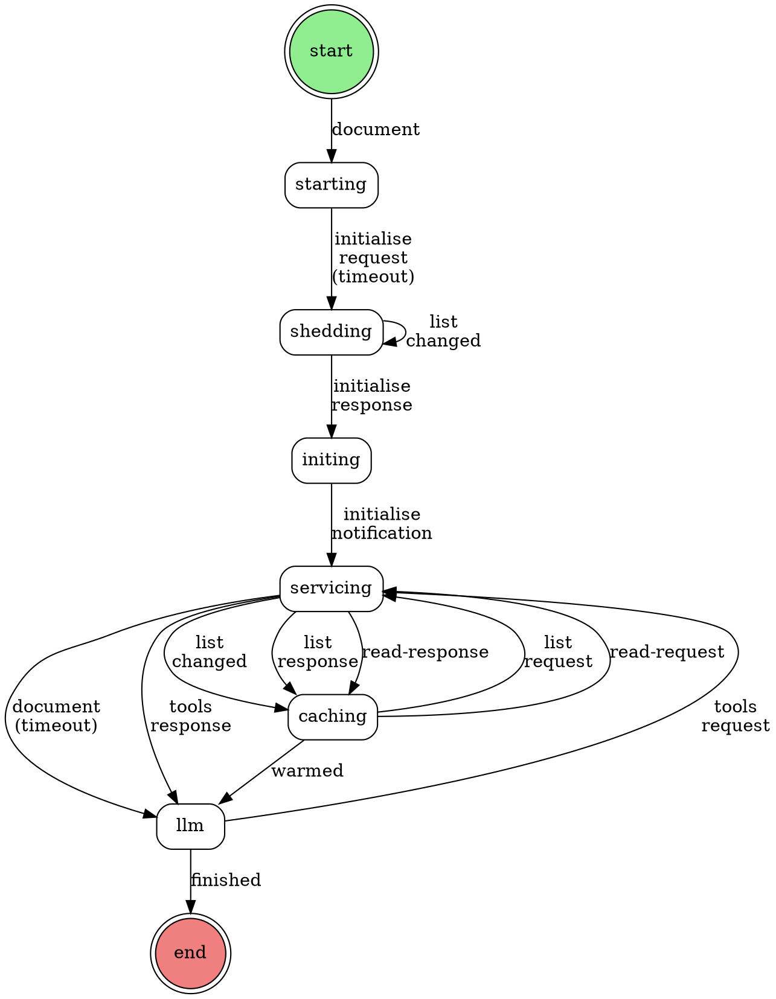

# MCP Integration via FSM

## Overview

CLAIJ integrates with Model Context Protocol (MCP) services by modeling the entire MCP protocol lifecycle as an explicit Finite State Machine. This approach makes the protocol flow visible, traceable, and schema-validated at every step.

**Key Insight:** Rather than hiding MCP interactions in opaque action functions, we express the protocol as FSM states and transitions. This provides:
- Self-documenting protocol flow
- Schema validation at each transition
- Visual representation of interactions
- Composability with other FSMs

## Architecture



## Protocol Flow

### Phase 1: Service Initialization

1. **starting** - Receives user's document, starts MCP bridge
2. **shedding** - Drains startup `list_changed` notifications (~26 messages)
3. **initing** - Receives initialization response with capabilities
4. **servicing** - Sends `initialized` notification (no response expected)
5. **→ llm** - Timeout triggers delivery of original document to LLM

**Document Flow:** The user's original request rides along in the wrapper through all initialization states, then gets unwrapped and delivered to the LLM once service is ready.

### Phase 2: Cache Population (Reactive)

Cache population is **event-driven**, not mandatory:

1. `list_changed` notification arrives at `servicing` state
2. Transition to `caching` state
3. Send list requests (tools, prompts, resources)
4. Receive list responses
5. Send read requests for resources
6. Receive resource content
7. When cache complete → transition to `llm` with warmed cache

### Phase 3: Tool Execution

LLM can call MCP tools via `llm ↔ servicing` loop.

## Message Wrapping Pattern

All MCP protocol messages are wrapped at the application layer for FSM routing:

```clojure
;; Outbound (FSM → Service)
{"id" ["caching" "servicing"]
 "message" {"jsonrpc" "2.0", "id" 123, "method" "tools/list"}}

;; Inbound (Service → FSM)  
{"id" ["servicing" "caching"]
 "type" "response"
 "data" {"jsonrpc" "2.0", "id" 123, "result" {...}}}
```

Actions unwrap before sending to bridge, wrap responses for FSM routing.

## Key Design Decisions

### 1. Wrap/Unwrap Pattern

MCP protocol messages are wrapped in an application layer containing:
- `"id"` - Transition identifier for FSM routing
- `"message"` or `"data"` - The actual MCP payload
- `"type"` - Response classification (response/notification/timeout)

**Rationale:** Allows multiple possible transitions from one state based on message type/content.

### 2. Timeout Transitions

Uses `(alt!! oc timeout)` pattern to handle:
- Notification draining (shedding state)
- No-response protocols (initialized notification)

**Rationale:** No FSM extensions needed - timeout is just another data value.

### 3. Reactive Cache

Cache population triggered by `list_changed` notifications, not mandatory initialization step.

**Rationale:** 
- Service can be used immediately without waiting for cache
- Cache stays fresh via notifications
- LLM decides if/when cache is needed

### 4. Present Participle State Names

States named as actions in progress: `starting`, `shedding`, `initing`, `servicing`, `caching`.

**Rationale:** Clearer distinction between state name and action name, reads naturally in logs.

---

## 📊 Implementation Status & Roadmap

### Priority Legend
- **MUST HAVE:** Critical path to working MCP integration
- **SHOULD HAVE:** Post-integration polish
- **NICE TO HAVE:** Future enhancements

### Status Legend
- ✅ **DONE** - Complete and tested
- 🚧 **IN PROGRESS** - Active work
- ⏸️ **TODO** - Planned but not started

---

## MUST HAVE (Critical Path)

### ✅ Issue 5: Context Threading - **DONE**
**Problem:** Context not threaded through FSM, nowhere to store cache

**Solution:** FSM actions now return `[new-context output]` instead of just `output`

**Impact:** Foundation for cache storage and state management

**Status:** ✅ Complete
- All FSM actions updated to thread context
- All tests updated and passing
- Context flows through entire FSM lifecycle

---

### 🚧 Issue 4: Cache Construction - **IN PROGRESS**
**Problem:** Cache actions don't build actual cache structure

**Solution:** Extract helper functions from `handle` in `mcp_test.clj`, integrate into FSM actions

**Status:** 🚧 **CURRENTLY ACTIVE**

**Completed:**
- ✅ Helper functions extracted and tested:
  - `merge-resources` - Merges resource contents into cache
  - `initialize-mcp-cache` - Initializes cache from capabilities
  - `invalidate-mcp-cache-item` - Invalidates cache on list_changed
  - `refresh-mcp-cache-item` - Refreshes cache with new data
- ✅ Functions integrated into MCP FSM actions
- ✅ Production code properly organized in `src/claij/fsm/mcp_fsm.clj`
- ✅ Test code separated in `test/claij/fsm/mcp_fsm_test.clj`

**Remaining Work:**
- ❌ Comprehensive action-level unit tests verifying cache mutations
- ❌ Full integration test proving cache flows start→end
- ❌ Verification that populated cache reaches LLM action

**Note on Test Infrastructure (DEFERRED):**

Current tests use real `clojure-mcp` process (slow, heavy, non-deterministic).
Researched creating in-process test MCP bridge for faster unit tests:
- Data-driven minimal responses
- Deterministic behavior  
- Fast execution (<100ms vs 9s)
- Reference: `@modelcontextprotocol/server-everything` (TypeScript, can't run in JVM)

Decision: Defer test bridge creation (time/token constraints). Current integration 
tests work adequately. Revisit when adding more complex MCP features (pagination,
subscriptions, progress, logging). See SESSION_HANDOFF.md for details.

**Critical Gap:** Need proof that we can traverse the entire FSM from start to end, building cache progressively, and delivering it to the LLM state. Current tests are minimal smoke tests.

---

### ⏸️ Issue 6: Schema Tightening - **TODO**
**Problem:** LLM transitions accept `"schema" true` (anything goes)

**Solution:** Define proper JSON schemas for:
- Tools request/response format
- Cache structure passed to LLM
- Completion criteria

**Why Blocked:** Needs Issue 2 (FSM Composition) decided first to know LLM interface

**Estimated Effort:** Medium (extract from big MCP schema)

---

### ⏸️ Issue 2: FSM Composition - **TODO**
**Problem:** Unclear how MCP FSM and LLM FSM should relate

**Options Explored:**

---

#### Option A: Merged Dev-FSM (Original Idea)

Manually merge code-review-fsm + mcp-fsm into a single "development FSM":

```
start → mc (cheap planning LLM, no tools)
         ↓
        starting → shedding → initing → servicing → caching
         ↓
        proxy-llm (expensive LLM with MCP tools)
         ↓ ↓
         │ ├→ work-complete → mc → end
         │ └→ needs-guidance → mc → proxy-llm (retry)
```

**Pros:**
- Single FSM, simpler mental model
- Direct state transitions

**Cons:**
- Manual merge - doesn't compose
- Tight coupling between code-review and MCP concerns
- Trail pollution - all MCP protocol events visible to MC

**Key Design Points:**
1. MC coordination: High-level planning LLM separate from execution
2. Selective tool access: MC doesn't see tools, only proxy does
3. Summarization: Proxy must summarize work back to MC
4. Token efficiency: MC cheap, proxy expensive only when working
5. Guidance loop: Proxy can request help when stuck

**Status:** Documented in `doc/DEV_FSM_IMPLEMENTATION.md`, code files empty (write failed)

---

#### Option B: Wrapper/Sub-FSM Composition (Current Direction)

Clone code-review-fsm, add single `mcp-proxy` state that wraps mcp-fsm:

```
code-review-fsm (cloned as "dev-fsm")
│
├── mc ←→ reviewer (existing review loop)
│
├── mc → mcp-proxy (NEW)
│         │
│         │  action:
│         │    1. stash current trail
│         │    2. start/reuse mcp-fsm
│         │    3. submit to mcp-fsm
│         │    4. await mcp-fsm completion
│         │    5. restore stashed trail
│         │    6. return result → mc
│         │
├── mcp-proxy → mc (NEW)
│
└── mc → end


mcp-fsm (extended - see below)
│
├── starting → shedding → initing → servicing → caching
│
├── caching → llm (cache built, proxy-llm ready)
│
├── llm → servicing (NEW: proxy makes tool call)
│
├── servicing → llm (NEW: tool result returns)
│
└── llm → end (proxy done, summarizes)
```

**Pros:**
- Clean composition - mcp-fsm stays untouched
- Trail isolation is explicit (stash/restore)
- Reusable pattern for any sub-FSM
- Concerns separated - MC doesn't see MCP protocol details

**Cons:**
- Two FSMs to reason about
- Need async coordination (await sub-FSM)
- MC→mcp-proxy schema needs thought (how much does MC specify?)

**Open Question:** MC→mcp-proxy schema shape
- MC needs "menu" of services in prompt (e.g., "clojure-mcp: file editing, REPL")
- MC emits service name + natural language intent?
- Or more structured task specification?
- The mcp-fsm's llm state sees full tool definitions and does actual work

**Status:** Active exploration direction

---

**Impact:** Affects cache → LLM flow structure and schema definitions

**Decision:** Pursuing Option B (wrapper approach) - cleaner composition

**Estimated Effort:** Small (decision) + Medium (implementation)

---

## SHOULD HAVE (Post-Integration Polish)

### ⏸️ Issue 1: Trail Pollution - **TODO**
**Problem:** All MCP protocol events going into trail, appear in LLM prompts

**Solution:** Add `"include-in-trail"` flag to transitions/states to filter protocol messages

**Impact:** Cleaner, more focused LLM prompts

**Implementation:** Boolean flag on transition schema, honored by FSM machinery

---

### ⏸️ Issue 3: Test Coverage - **TODO**
**Problem:** Shedding works so well that cache logic not properly exercised

**Solution:** Create test that triggers cache invalidation via `list_changed` notification

**Impact:** Robustness confidence in reactive cache population

---

## NICE TO HAVE (Future Enhancement)

### ⏸️ Issue 7: Self-Reflexive Transitions - **TODO**
**Problem:** FSM doesn't support `state → state` transitions (self-loops) natively

**Current Workaround:** Recursive hack in actions (e.g., message shedding loop)

**Diagram Shows:** `shedding -> shedding` but not implemented in FSM machinery

**Future:** FSM should handle self-reflexive transitions as first-class citizens

**Use Cases:** 
- Draining notification queues
- Accumulating events before proceeding
- Filtering/buffering states

---

## 🎯 Current Focus: Thread Coordination Infrastructure

**Problem Discovered:** Integration tests use `Thread/sleep` which is:
- Non-deterministic (timing-dependent failures)
- Slow (must wait for worst-case timing)
- Fragile (breaks in CI/production)
- Against our coding standards

**Decision:** Before completing Issue 4 tests, we need proper async coordination.

**Going Down the Thread Coordination Rabbit Hole:**

We're pausing Issue 4 (Cache Construction) to build the foundation it needs:

1. **Implement FSM completion signaling**
   - FSMs provide promises/latches for completion
   - Shared start/end actions manage coordination
   - Tests await FSM completion deterministically
   - No more `Thread/sleep` guessing

2. **Make this generic and reusable**
   - Works for all FSMs, not just MCP
   - Supports FSM composition (sub-FSMs signal parent)
   - Part of the generic FSM testing infrastructure vision

3. **Then return to Issue 4**
   - Write comprehensive cache flow tests
   - Use proper async coordination
   - Prove end-to-end FSM traversal with cache

**Status:** About to dive into thread coordination implementation

**Why This Matters:**
- Without proper coordination, we can't reliably test async FSM behavior
- This infrastructure will benefit all future FSM tests
- Solves a systemic problem, not just an MCP-specific one

**Previous Issue 4 Goals (deferred until coordination infrastructure ready):**

1. **Action-Level Tests:** Each action correctly mutates cache
2. **Full Integration Test:** Complete FSM traversal with cache verification
3. **Cache Flow Verification:** Cache flows from init → cache → llm

---

## Implementation Files

- **Production:** `src/claij/fsm/mcp_fsm.clj`
- **Tests:** `test/claij/fsm/mcp_fsm_test.clj`
- **Cache Helpers:** `src/claij/mcp.clj` 
- **Cache Helper Tests:** `test/claij/mcp_test.clj`

---

## References

- MCP Spec: https://spec.modelcontextprotocol.io/
- FSM Core: `src/claij/fsm.clj`
- Bridge Implementation: `src/claij/mcp/bridge.clj`

---

## Next Actions

**IMMEDIATE - Thread Coordination Infrastructure:**
1. Design FSM completion signaling mechanism
   - How FSMs signal they've reached end state
   - How tests wait for completion
   - How to make it generic and reusable
2. Implement in FSM core machinery
3. Update MCP FSM to use new coordination
4. Update tests to use promises/latches instead of Thread/sleep

**THEN - Complete Issue 4 (Cache Construction):**
1. Write comprehensive action-level unit tests
2. Build full integration test with proper async coordination
3. Prove end-to-end FSM traversal with cache delivery to LLM

**FINALLY - Proceed To Other Issues:**
1. Issue 2: Decide FSM composition strategy
2. Issue 6: Define proper schemas for LLM transitions
3. Issues 1 & 3: Polish and coverage

---

## 🔮 Future: Generic FSM Testing Infrastructure

**Problem:** Every FSM needs testing - we shouldn't reinvent instrumentation each time.

**Solution 1: FSM Records Its Own Path**
- FSM machinery should track state/transition traversal automatically
- No external instrumentation needed per FSM
- Always available for debugging
- Consistent across all FSMs

**Solution 2: FSM-Centric Trail (relates to Issue 1)**
- Trail serves FSM debugging/testing as primary purpose
- Post-process/filter trail before sending to LLM
- Separates concerns: complete path for testing, curated context for LLM

**Solution 3: Latch-Based End Coordination**
- Shared `start-action` creates promise/latch in context
- Shared `end-action` releases latch  
- Tests `await` latch instead of `Thread/sleep`
- Works for FSM composition: sub-FSMs signal parent completion
- Benefits:
  - No more guessing wait times
  - Proper async coordination
  - Composable FSM pattern
  - Reusable across all FSMs

**Status:** Design phase - implement after MCP integration complete
